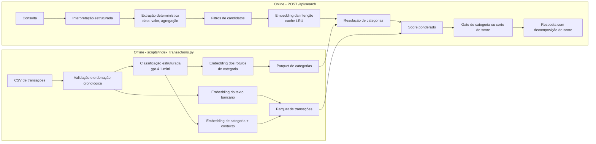

# Pierre - busca semântica de transações

[Abrir demonstração em produção](https://pierre-interview.vercel.app)

Este repositório é a submissão para o desafio **AI Engineer: Semantic
Transaction Search**. O Pierre permite encontrar transações de um extrato em
linguagem natural, inclusive quando os termos da busca não aparecem literalmente
nos dados bancários. Por exemplo, uma busca por **"delivery"** pode retornar
uma transação `IFOOD *RESTAURANTE`.

Além da busca, a demonstração em produção mostra os motivos de cada resultado,
aceita filtros de período, valor e estabelecimento e disponibiliza uma área de
avaliação de qualidade e carga.

## Resumo técnico

**Propósito.** Recuperar transações a partir de uma descrição em linguagem
natural, sem depender de correspondência literal de texto.

**Pipeline offline (indexação).** Executado por `scripts/index_transactions.py`,
fora do caminho da requisição. Lê o CSV, classifica cada transação com
`gpt-4.1-mini` e grava dois Parquets: o índice de transações com dois vetores
por registro, e o vocabulário de categorias com um vetor por categoria.

**Pipeline online (busca).** Executado a cada `POST /api/search`. Interpreta a
consulta, aplica filtros determinísticos, resolve a consulta a categorias por
similaridade de vetores, pontua os candidatos e devolve resultados com a
decomposição do score.

**Garantias principais.**

| Garantia | Mecanismo |
| --- | --- |
| Nenhuma chamada de LLM classifica transações durante a busca | Enriquecimento e embeddings de transação são gravados no Parquet na indexação |
| Período, faixa de valor e agregação não dependem do modelo | Extraídos por expressão regular em `fallback_interpretation`, que tem precedência sobre a saída do LLM |
| A busca continua utilizável se a API de interpretação falhar | A exceção é capturada e o resultado determinístico é usado |
| Uma consulta que nomeia uma categoria não retorna outras categorias | Gate de categoria por similaridade, aplicado antes do corte de score |
| Índice sem o artefato de categorias continua servindo buscas | `_load_categories` devolve vocabulário vazio e o gate é desativado |

## Como o desafio é respondido

| Pergunta do enunciado | Decisão adotada |
| --- | --- |
| Como "Delivery" encontra iFood se a palavra não existe no extrato? | Cada transação recebe embeddings do texto bancário original e de um contexto enriquecido. Assim, a semântica de "delivery" pode se aproximar de `iFood` e de sua descrição mesmo sem correspondência literal. |
| Onde essa associação fica representada? | No índice Parquet: `raw_embedding` preserva merchant e descrição; `enriched_embedding` representa a categoria e o contexto inferidos. A categoria não substitui o dado original. |
| Como lidar com ambiguidades, como "comida" ou "viagem"? | O sistema não usa uma taxonomia rígida como resposta única. "viagens" resolve simultaneamente para `passagem aérea` e `hospedagem`, porque o gate mantém todas as categorias dentro de `CATEGORY_GATE_RATIO` da melhor. Período, valor e merchant nomeado atuam como filtros objetivos. |
| Como evitar resultados absurdos? | Consultas excessivamente vagas são rejeitadas com HTTP 422. Filtros estruturados reduzem o conjunto candidato antes do ranking. Consultas que resolvem para categorias ficam restritas a elas; as demais precisam superar `SEARCH_MIN_SCORE`. |
| E um merchant que nunca apareceu? | A busca continua usando merchant e descrição originais, sem depender de uma tabela fechada de merchants. No enriquecimento, baixa confiança vira `desconhecido`, em vez de forçar uma categoria. |
| Onde usar LLM e onde ser determinístico? | O LLM é usado no enriquecimento offline e na interpretação estruturada da consulta. Validações, filtros, composição do score, threshold, ordenação e fallback para datas/valores são determinísticos. |

## Arquitetura



### Pipeline offline: indexação

Executado manualmente; nunca durante uma busca.

| Etapa | Entrada | Processamento | Saída persistida |
| --- | --- | --- | --- |
| 1. Validação | `ai_engineer_semantic_transactions.csv` | Verifica campos obrigatórios, datas, IDs únicos, valores e textos não vazios | — |
| 2. Classificação | Transação + até `ENRICHMENT_HISTORY_LIMIT` casos anteriores semelhantes | `gpt-4.1-mini` devolve contexto, até três categorias candidatas, confiança e justificativa | Colunas `enriched_context`, `category`, `category_confidence` |
| 3. Embedding do original | `merchant` + `description` | `text-embedding-3-small` | `raw_embedding` |
| 4. Embedding do enriquecido | `categoria: X \| contexto: Y` | `text-embedding-3-small` | `enriched_embedding` |
| 5. Vocabulário de categorias | Rótulos distintos de categoria do índice | `text-embedding-3-small`, um vetor por rótulo | `..._category_embeddings.parquet` |

Definições:

- **contexto enriquecido**: texto curto gerado pelo LLM que descreve a natureza
  do gasto em palavras que não estão no extrato. É o que permite "delivery"
  alcançar `IFOOD *RESTAURANTE`.
- **confiança**: probabilidade auto-reportada pelo modelo para a categoria
  escolhida. Abaixo de `UNKNOWN_CATEGORY_THRESHOLD` (padrão `0.62`) a categoria
  vira `desconhecido`, em vez de forçar um palpite.

As transações são processadas em ordem cronológica, então a classificação de um
registro só enxerga casos anteriores. Hashes por registro reaproveitam
classificações e embeddings inalterados em reindexações.

### Pipeline online: busca e ranking

Sequência executada a cada requisição, nesta ordem:

**a) Interpretação da consulta.** `gpt-4.1-mini` com `temperature=0` devolve
intenção semântica, período, faixa de valor e merchant nomeado. O resultado é
guardado num cache LRU por consulta normalizada, dimensionado por
`QUERY_CACHE_SIZE`. Falha de API cai no passo (b) isoladamente.

**b) Extração determinística.** Expressões regulares extraem mês, comparações
numéricas e intenção de agregação, e removem esses trechos da intenção
semântica para que não poluam o vetor da consulta. Quando essa extração encontra
evidência, ela tem precedência sobre os mesmos campos vindos do modelo.

**c) Filtragem de candidatos.** Data, faixa de valor e merchant são aplicados
sobre o índice antes de qualquer cálculo de similaridade. Filtros da requisição
têm precedência sobre os inferidos da consulta.

**d) Embedding da consulta.** A intenção semântica é vetorizada com
`text-embedding-3-small` e servida por cache LRU.

**e) Score ponderado.** Para cada candidato:

```text
0,45 × similaridade do texto bancário original
+ 0,35 × similaridade do contexto enriquecido
+ 0,15 × aderência lexical de categoria
+ 0,05 × aderência lexical de merchant
```

**f) Gate de categoria ou corte de score.** O vetor da intenção é comparado aos
vetores do vocabulário de categorias. Se a melhor similaridade atinge
`CATEGORY_GATE_FLOOR`, a consulta é considerada dirigida a categorias: são
selecionadas todas as categorias com pelo menos `CATEGORY_GATE_RATIO` da melhor,
e apenas transações dessas categorias entram no resultado. Nesse caminho o corte
de score não é aplicado — a pertinência já foi estabelecida pela categoria, e
truncar por score tornaria um total de agregação incompleto. Se a melhor
similaridade fica abaixo do piso, a consulta é considerada ampla: a recuperação
permanece aberta e `SEARCH_MIN_SCORE` é o que limita a cauda. O gate não é
aplicado quando a consulta nomeia um merchant, porque o filtro de merchant já é
mais restritivo.

| Parâmetro | Padrão | Efeito |
| --- | --- | --- |
| `CATEGORY_GATE_FLOOR` | `0.50` | Similaridade mínima para a consulta ser tratada como dirigida a categorias |
| `CATEGORY_GATE_RATIO` | `0.88` | Fração da melhor similaridade que mantém categorias irmãs juntas |
| `SEARCH_MIN_SCORE` | `0.28` | Corte aplicado somente a consultas amplas, sem gate |

**g) Resposta.** Cada resultado traz score, decomposição do score em seus quatro
componentes, os sinais que dispararam e uma frase legível. A resposta também traz
`total_amount_brl`, a soma dos valores retornados, que é a resposta direta quando
`interpretation.aggregation` é `"sum"`.

#### Por que a escala relativa

Um piso absoluto sobre o score final não separa as consultas: os relevantes de
`corridas de aplicativo` pontuam entre `0,37` e `0,46`, enquanto nenhuma
transação de viagem passa de `0,32`. Qualquer corte único sacrifica um dos dois.
A resolução por categoria decide pertinência antes do score, o que remove essa
dependência. A seleção de categorias irmãs usa fração da melhor similaridade, e
não distância absoluta, porque a escala de similaridade varia por consulta.

## Módulos

| Caminho | Responsabilidade |
| --- | --- |
| `app/main.py` | Aplicação FastAPI, ciclo de vida do índice, API e entrega do frontend estático. |
| `app/search.py` | Carregamento do índice e do vocabulário de categorias, cache de embeddings, filtros, resolução de categorias, ranking, corte, explicações e registro de feedback. |
| `app/query.py` | Interpretação estruturada da busca e extração determinística de mês, faixa de valor e agregação. |
| `app/enrichment.py` | Contratos Pydantic e enriquecimento de transações com categoria, confiança e contexto. |
| `app/prompts.py` | Prompt de sistema usado durante o enriquecimento. |
| `app/models.py` | Contratos de requisição e resposta da API. |
| `app/evaluation.py` | Execução do golden set e cálculo de recall, MRR, taxa de acerto e latência. |
| `scripts/index_transactions.py` | Pipeline de indexação e cache incremental. |
| `scripts/evaluate_search.py` | Relatório de qualidade via HTTP. |
| `scripts/load_search.py` | Teste de carga concorrente via HTTP. |
| `web/` | Interface estática: busca, filtros, detalhes, feedback e painel de avaliação. |
| `data/evaluation/` | Corpus sintético independente e golden set rotulado. Veja seu [README](data/evaluation/README.md). |
| `tests/` | Testes unitários de enriquecimento, interpretação, busca e ativos de avaliação. |

## Demonstração e API

A aplicação está publicada na Vercel e já inclui o índice de demonstração com
250 transações. Consultas verificadas contra o índice publicado:

| Consulta | Comportamento |
| --- | --- |
| `corridas de aplicativo` | Gate resolve `transporte por aplicativo`; 13 transações Uber/99 |
| `viagens acima de R$ 500` | Gate resolve `passagem aérea` + `hospedagem`; mínimo de R$ 500; 28 transações |
| `compras no Carrefour` | Merchant resolvido; gate não é aplicado; 7 transações |
| `quanto paguei em streaming?` | Agregação `sum`; gate resolve as duas categorias de streaming; 24 transações e total |
| `compras acima de R$ 300 em junho` | Consulta ampla, sem gate; mínimo de R$ 300 e período de junho |

Endpoints principais:

| Método | Endpoint | Finalidade |
| --- | --- | --- |
| `GET` | `/api/health` | Estado do índice e quantidade de transações. |
| `POST` | `/api/search` | Busca por linguagem natural com filtros opcionais. |
| `POST` | `/api/feedback` | Registra se um resultado foi relevante. |
| `GET` | `/api/evaluation/status` | Disponibilidade do corpus de avaliação. |
| `POST` | `/api/evaluation/quality` | Executa o golden set no índice ativo. |

Exemplo de busca:

```bash
curl -X POST https://pierre-interview.vercel.app/api/search \
  -H 'Content-Type: application/json' \
  -d '{"query":"delivery acima de R$ 100 em julho","filters":{}}'
```

## Avaliação

O corpus em `data/evaluation/` é separado da base de demonstração e contém
aliases, descrições truncadas, recorrência, estornos, valores negativos e casos
ambíguos. Seu golden set declara IDs relevantes e status esperados. A avaliação
mede:

- `recall@k`: proporção de resultados relevantes recuperados;
- `MRR@k`: posição do primeiro resultado relevante;
- taxa de acerto de status e de casos;
- latência p50, p95 e p99 da execução do motor.

O painel também pode disparar carga HTTP concorrente e reporta taxa de erro,
throughput e percentis. A avaliação só é habilitada quando os IDs do índice
ativo correspondem ao corpus rotulado, evitando métricas enganosas entre bases
diferentes.

Para executar os testes de regressão do repositório:

```bash
python -m unittest discover -s tests -v
```

## Limites atuais

- **Os limiares não foram calibrados com dados rotulados.** `SEARCH_MIN_SCORE`,
  `CATEGORY_GATE_FLOOR` e `CATEGORY_GATE_RATIO` foram escolhidos observando a
  separação entre consultas neste corpus de 250 transações e 21 categorias.
  Não há otimização sobre um conjunto de treino, e nada garante que se
  transfiram para outro corpus.
- **O gate depende da qualidade dos rótulos de categoria.** Se a classificação
  offline errar a categoria de uma transação, o gate a exclui de forma
  determinística. O erro fica mais visível do que ficaria com recuperação
  puramente semântica.
- **O feedback não persiste na Vercel.** O filesystem da Function é efêmero;
  `/api/feedback` grava em `/tmp` e o registro se perde entre invocações.
- **O enriquecimento não roda em tempo de busca.** Uma transação nova só é
  pesquisável depois de reindexada, e uma categoria nova só entra no gate
  depois que o Parquet de categorias é regravado.
- **Os caches são por instância e dependem de dados, prompt, modelo e limiares.**
  Um cold start na Vercel começa com cache vazio. Nenhum cache é invalidado
  automaticamente quando prompt ou modelo muda.
- **A aderência lexical de categoria ainda conta palavras vazias.** `_term_match`
  trata "de" como termo comum, o que dá um pequeno crédito indevido a categorias
  não relacionadas. Corrigir isso foi medido e não alterou nenhum resultado após
  a introdução do gate, então a mudança não foi aplicada.

## Decisões e trade-offs

- **Custo e latência:** classificação e embeddings de transação acontecem na
  indexação, não a cada busca. A busca faz no máximo duas chamadas de modelo
  (interpretação e embedding da consulta), ambas com cache LRU, e o gate de
  categoria reutiliza o vetor já calculado, sem chamada adicional.
- **Consistência:** filtros, resolução de categorias, composição do score,
  corte e ordenação são determinísticos para um mesmo índice e uma mesma
  interpretação. `temperature=0` reduz a variação de fraseio da interpretação
  entre requisições.
- **Contrato da API:** `interpretation.aggregation`, `interpretation.categories`
  e `total_amount_brl` foram adicionados. São campos novos com valor padrão;
  nenhum campo existente mudou de nome, tipo ou significado.
- **Escala:** o Parquet em memória é apropriado para esta demonstração. Para
  100 milhões de transações, a evolução natural é particionar por usuário e
  data, filtrar metadados antes da busca e substituir a matriz local por um
  índice vetorial aproximado (HNSW/IVF) com recuperação híbrida. A etapa de
  re-ranking e explicação pode permanecer idêntica sobre um conjunto pequeno de
  candidatos.
- **Novas categorias:** distribuições de `desconhecido`, baixa confiança,
  clusters de embeddings e feedback negativo permitem identificar merchants ou
  conceitos emergentes sem alterar uma lista fixa de categorias.
- **Personalização:** o feedback é registrado por consulta e transação; uma
  evolução segura é aplicá-lo como sinal de re-ranking por usuário, mantendo o
  índice global e os critérios de relevância estáveis. Em produção ele deve ir
  para um armazenamento durável.

## Stack

Python 3.12+, FastAPI, Pydantic, Pandas/PyArrow, NumPy, OpenAI Responses API,
`gpt-4.1-mini`, `text-embedding-3-small`, HTML/CSS/JavaScript e Vercel.

## Decisão documentada

Uma regressão que reduzia o motor a um único embedding foi analisada em
[`docs/incidents/2026-08-14-semantic-search-regression.md`](docs/incidents/2026-08-14-semantic-search-regression.md).
O índice de dois canais e o ranking híbrido são mantidos justamente para não
perder o equilíbrio entre o texto bancário original e o significado inferido.
