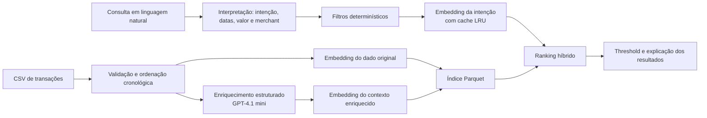

# Pierre - busca semântica de transações

[Abrir demonstração em produção](https://pierre-interview.vercel.app)

Este repositório é a submissão para o desafio **AI Engineer: Semantic
Transaction Search**. O Pierre permite encontrar transações de um extrato em
linguagem natural, inclusive quando os termos da busca não aparecem literalmente
nos dados bancários. Por exemplo, uma busca por **"delivery"** pode retornar
uma transação `IFOOD *RESTAURANTE`.

Além da busca, a demonstração em produção mostra os motivos de cada resultado,
aceita filtros de período, valor e estabelecimento e disponibiliza uma área de
avaliação de qualidade e carga.

## Como o desafio é respondido

| Pergunta do enunciado | Decisão adotada |
| --- | --- |
| Como "Delivery" encontra iFood se a palavra não existe no extrato? | Cada transação recebe embeddings do texto bancário original e de um contexto enriquecido. Assim, a semântica de "delivery" pode se aproximar de `iFood` e de sua descrição mesmo sem correspondência literal. |
| Onde essa associação fica representada? | No índice Parquet: `raw_embedding` preserva merchant e descrição; `enriched_embedding` representa a categoria e o contexto inferidos. A categoria não substitui o dado original. |
| Como lidar com ambiguidades, como "comida" ou "viagem"? | O sistema não usa uma taxonomia rígida como resposta única. Combina os dois canais semânticos, categoria e merchant; período, valor e merchant nomeado atuam como filtros objetivos. O resultado expõe os sinais que contribuíram para a decisão. |
| Como evitar resultados absurdos? | Consultas excessivamente vagas são rejeitadas. Antes do ranking, filtros estruturados reduzem o conjunto candidato; depois, um score híbrido precisa superar `SEARCH_MIN_SCORE`. |
| E um merchant que nunca apareceu? | A busca continua usando merchant e descrição originais, sem depender de uma tabela fechada de merchants. No enriquecimento, baixa confiança vira `desconhecido`, em vez de forçar uma categoria. |
| Onde usar LLM e onde ser determinístico? | O LLM é usado no enriquecimento offline e na interpretação estruturada da consulta. Validações, filtros, composição do score, threshold, ordenação e fallback para datas/valores são determinísticos. |

## Arquitetura



### Indexação: o que acontece com cada transação

1. `scripts/index_transactions.py` valida o CSV (campos obrigatórios, datas,
   IDs únicos, valores e textos não vazios).
2. As transações são processadas em ordem cronológica. O enriquecedor recebe
   apenas casos anteriores semelhantes, evitando que um registro use
   informação do futuro.
3. `gpt-4.1-mini` retorna contexto, até três categorias candidatas, confiança
   e justificativa em formato estruturado. Abaixo de
   `UNKNOWN_CATEGORY_THRESHOLD` (padrão: `0.62`), a categoria passa a ser
   `desconhecido`.
4. São produzidos dois vetores com `text-embedding-3-small`:

   - **original**: `merchant` + `description`, para preservar o sinal bancário;
   - **enriquecido**: categoria + contexto, para capturar conceitos que não
     aparecem literalmente no extrato.

5. O resultado é persistido em
   `data/ai_engineer_semantic_transactions_embeddings.parquet`. Hashes dos
   registros permitem reaproveitar enriquecimentos e embeddings inalterados em
   reindexações.

### Busca e ranking

A consulta é interpretada em intenção semântica, período, faixa de valor e
merchant. Meses e comparações numéricas têm parsing determinístico; se a
chamada de interpretação falhar, esse mesmo fallback mantém a busca utilizável.

Os filtros de data, valor e merchant são aplicados antes do ranking. Para cada
transação candidata, o score é:

```text
0,45 × similaridade do dado original
+ 0,35 × similaridade do contexto enriquecido
+ 0,15 × aderência de categoria
+ 0,05 × aderência de merchant
```

Resultados abaixo de `SEARCH_MIN_SCORE` (padrão: `0.28`) são descartados. Cada
resposta inclui score, decomposição do score, sinais encontrados e uma
explicação legível - por exemplo, categoria inferida, semelhança da descrição,
contexto enriquecido e filtros atendidos. Isso torna a ordenação auditável sem
expor o usuário a uma decisão opaca de "caixa-preta".

## Módulos

| Caminho | Responsabilidade |
| --- | --- |
| `app/main.py` | Aplicação FastAPI, ciclo de vida do índice, API e entrega do frontend estático. |
| `app/search.py` | Carregamento do índice, cache de embeddings da consulta, filtros, ranking, threshold, explicações e registro de feedback. |
| `app/query.py` | Interpretação estruturada da busca e fallback determinístico para mês e faixa de valor. |
| `app/enrichment.py` | Contratos Pydantic e enriquecimento de transações com categoria, confiança e contexto. |
| `app/prompts.py` | Prompt de sistema usado durante o enriquecimento. |
| `app/models.py` | Contratos de requisição e resposta da API. |
| `app/evaluation.py` | Execução do golden set e cálculo de recall, MRR, taxa de acerto e latência. |
| `scripts/index_transactions.py` | Pipeline de indexação e cache incremental. |
| `scripts/evaluate_search.py` | Relatório de qualidade via HTTP. |
| `scripts/load_search.py` | Teste de carga concorrente via HTTP. |
| `web/` | Interface estática: busca, filtros, detalhes, feedback e painel de avaliação. |
| `data/evaluation/` | Corpus sintético independente e golden set rotulado. Veja seu [README](data/evaluation/README.md). |
| `tests/` | Testes unitários de enriquecimento, interpretação, busca e ativos de avaliação. |

## Demonstração e API

A aplicação está publicada na Vercel e já inclui o índice de demonstração com
250 transações. Alguns exemplos para testar na interface:

- `corridas de aplicativo`
- `viagens acima de R$ 500`
- `compras no Carrefour`
- `delivery acima de R$ 100 em julho`

Endpoints principais:

| Método | Endpoint | Finalidade |
| --- | --- | --- |
| `GET` | `/api/health` | Estado do índice e quantidade de transações. |
| `POST` | `/api/search` | Busca por linguagem natural com filtros opcionais. |
| `POST` | `/api/feedback` | Registra se um resultado foi relevante. |
| `GET` | `/api/evaluation/status` | Disponibilidade do corpus de avaliação. |
| `POST` | `/api/evaluation/quality` | Executa o golden set no índice ativo. |

Exemplo de busca:

```bash
curl -X POST https://pierre-interview.vercel.app/api/search \
  -H 'Content-Type: application/json' \
  -d '{"query":"delivery acima de R$ 100 em julho","filters":{}}'
```

## Avaliação

O corpus em `data/evaluation/` é separado da base de demonstração e contém
aliases, descrições truncadas, recorrência, estornos, valores negativos e casos
ambíguos. Seu golden set declara IDs relevantes e status esperados. A avaliação
mede:

- `recall@k`: proporção de resultados relevantes recuperados;
- `MRR@k`: posição do primeiro resultado relevante;
- taxa de acerto de status e de casos;
- latência p50, p95 e p99 da execução do motor.

O painel também pode disparar carga HTTP concorrente e reporta taxa de erro,
throughput e percentis. A avaliação só é habilitada quando os IDs do índice
ativo correspondem ao corpus rotulado, evitando métricas enganosas entre bases
diferentes.

Para executar os testes de regressão do repositório:

```bash
python -m unittest discover -s tests -v
```

## Trade-offs, limitações e evolução para produção

- **Custo e latência:** enriquecimento e embeddings das transações acontecem na
  indexação, não em cada resultado. A consulta ainda usa LLM para interpretar
  intenção, mas possui fallback determinístico e cache LRU de embeddings. Em
  produção, a interpretação poderia usar modelo menor, regras mais amplas ou
  cache persistente por consulta normalizada.
- **Consistência:** o ranking, os filtros e thresholds são determinísticos para
  um mesmo índice e interpretação. A interpretação estruturada limita o LLM a
  campos específicos e exige evidências textuais.
- **Escala:** o Parquet em memória é apropriado para esta demonstração. Para
  100 milhões de transações, a evolução natural é particionar por usuário e
  data, filtrar metadados antes da busca e substituir a matriz local por um
  índice vetorial aproximado (HNSW/IVF) com recuperação híbrida. A etapa de
  re-ranking e explicação pode permanecer idêntica sobre um conjunto pequeno de
  candidatos.
- **Novas categorias:** distribuições de `desconhecido`, baixa confiança,
  clusters de embeddings e feedback negativo permitem identificar merchants ou
  conceitos emergentes sem alterar uma lista fixa de categorias.
- **Personalização:** o feedback é registrado por consulta e transação; uma
  evolução segura é aplicá-lo como sinal de re-ranking por usuário, mantendo o
  índice global e os critérios de relevância estáveis. No ambiente serverless
  atual, esse feedback é temporário porque o filesystem da Function não é
  persistente; em produção ele deve ir para um armazenamento durável.

## Stack

Python 3.12+, FastAPI, Pydantic, Pandas/PyArrow, NumPy, OpenAI Responses API,
`gpt-4.1-mini`, `text-embedding-3-small`, HTML/CSS/JavaScript e Vercel.

## Decisão documentada

Uma regressão que reduzia o motor a um único embedding foi analisada em
[`docs/incidents/2026-08-14-semantic-search-regression.md`](docs/incidents/2026-08-14-semantic-search-regression.md).
O índice de dois canais e o ranking híbrido são mantidos justamente para não
perder o equilíbrio entre o texto bancário original e o significado inferido.
